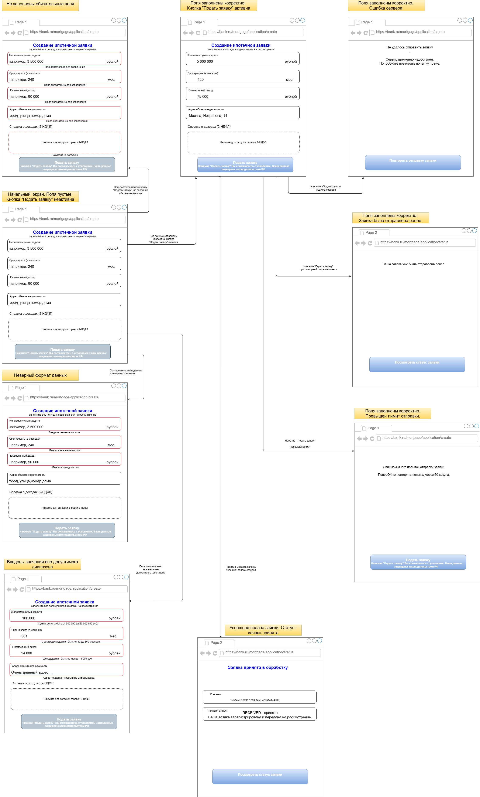

# Форма создания ипотечной заявки
## Назначение 
Спроектирован пользовательский интерфейс создания ипотечной заявки на основании API-контракта POST /applications. Форма учитывает обязательные поля, правила валидации, отображение ошибок и обработку ответов сервера.

[ссылка - API управления ипотечными сделками](https://raw.githubusercontent.com/ElenaG22/Learning_1/refs/heads/main/openapi.yaml)

---
## Предусловия
- Пользователь авторизован в системе.
- Пользователю доступна страница создания ипотечной заявки.
---
## Соответствие UI API-контракту

|Поле UI|Поле API|
|---|---|
|Желаемая сумма кредита|desiredAmount|
|Срок кредита (в месяцах)|termMonths|
|Ежемесячный доход|monthlyIncome|
|Адрес объекта недвижимости|propertyAddress|
|Справка о доходах (2-НДФЛ)|documentId|

## Порядок валидации
1. Проверка обязательности заполнения полей.
2. Проверка формата данных.
3. Проверка диапазонов и ограничений.
4. Отправка заявки.
5. Обработка ответа сервера.

## Сценарии валидации и отображение в UI

| Сценарий | Условие | Область проверки | Отображение в UI |
|---|---|---|---|
| Начальное состояние | Пользователь открыл форму | Все поля | Поля пустые, кнопка «Подать заявку» неактивна |
| Не заполнены обязательные поля | Пользователь не заполнил обязательные поля | Желаемая сумма кредита, срок кредита, ежемесячный доход, адрес объекта недвижимости, справка 2-НДФЛ | Поля подсвечиваются красным, под полями отображается сообщение об обязательности заполнения |
| Неверный формат данных | В числовые поля введён текст | Желаемая сумма кредита, срок кредита, ежемесячный доход | Числовые поля подсвечиваются красным, отображается сообщение «Введите значение числом» |
| Значения вне допустимого диапазона | Введены числа, которые не соответствуют ограничениям контракта | Желаемая сумма кредита: 500 000–50 000 000 руб.; срок кредита: 12–360 месяцев; ежемесячный доход: не менее 15 000 руб.; адрес объекта недвижимости: от 1 до 255 символов| Отображаются сообщения о допустимом диапазоне или ограничении длины |
| Все данные корректны | Все обязательные поля заполнены, значения соответствуют ограничениям | Все поля | Ошибки не отображаются, кнопка «Подать заявку» активна |
| Заявка принята в обработку | Сервер вернул 202 Accepted | Ответ сервера | Отображается сообщение «Заявка принята в обработку», идентификатор заявки, статус RECEIVED и кнопка «Посмотреть статус заявки» |
| Заявка уже была отправлена ранее | Сервер вернул 409 Conflict | Ответ сервера | Отображается сообщение «Заявка уже была отправлена ранее» и кнопка «Посмотреть статус заявки» |
| Превышен лимит отправки | Сервер вернул 429 Too Many Requests | Ответ сервера | Отображается сообщение «Слишком много запросов. Попробуйте отправить заявку через 60 секунд» и кнопка "Подать заявку"|
| Ошибка сервера | Сервер вернул 500 Internal Server Error или 503 Service Unavailable | Ответ сервера | Отображается сообщение «Не удалось отправить заявку. Сервис временно недоступен. Попробуйте повторить попытку позже» и кнопка "Повторить отправку заявки"|

## Макеты интерфейса
- Начальный  экран. Поля пустые. Кнопка "Подать заявку" неактивна.
- Не заполнены обязательные поля.
- Неверный формат данных.
- Введены значения вне допустимого диапазона.
- Поля заполнены корректно. Кнопка "Подать заявку" активна.
- Успешная подача заявки. Статус - заявка принята.
- Поля заполнены корректно. Ошибка сервера.
- Поля заполнены корректно. Заявка была отправлена ранее.
- Поля заполнены корректно. Превышен лимит отправки.
---
## Постусловия
***Успешный сценарий:***

- Заявка зарегистрирована в системе.
- Пользователю присвоен идентификатор заявки.
- Отображается статус "RECEIVED".
- Пользователю доступен просмотр статуса заявки.

***Неуспешный сценарий:***
- Если заявка не создана, пользователю отображается сообщение об ошибке.
- Если заявка уже была отправлена ранее, пользователю предлагается перейти к просмотру статуса заявки.
- Пользователь может повторить попытку отправки, если ошибка допускает повтор.